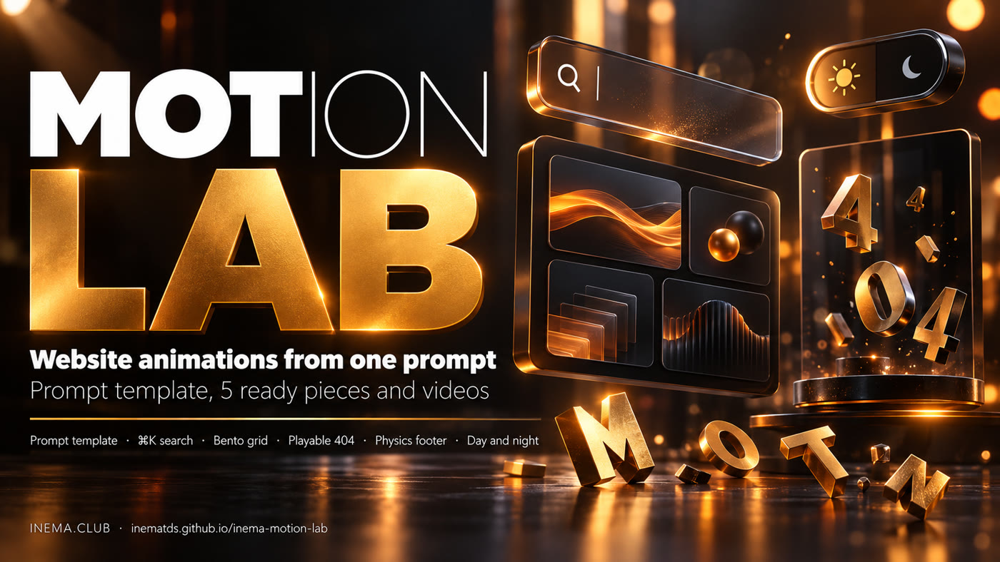

# INEMA Motion Lab

[](https://inematds.github.io/inema-motion-lab/guia/en/)

**🇧🇷 [Português](README.md) · 🇺🇸 [English](README.en.md) · 🇪🇸 [Español](README.es.md)**

## What it is

INEMA Motion Lab teaches you how to ask an AI (Claude, Codex or another one) for website animations and get something with a professional finish, not a generic effect. It brings a three-part prompt template (appearance, motion and rules) and twenty real examples made with it: searches and menus, footers, galleries, buttons, a playable 404 page, a loading screen and a day/night theme button, all with X-ray and a `?motion=off` mode. Each piece is a single HTML file that you open in the browser and paste into your site, and it comes with the prompt that generated it and a short video. It is for anyone who builds pages, guides or courses and wants motion without relying on a heavy library.

## 📖 How-to guide

Full guide (landing + step by step, with the pieces live): **https://inematds.github.io/inema-motion-lab/guia/en/**

## Contents

| Folder | What it has |
|---|---|
| `molde/MOLDE-PROMPT-ANIMACAO.md` | The prompt template: appearance, numbered motion, technical rules |
| `pecas/<name>/PROMPT.md` | The prompt for each piece, written with the template (in Portuguese) |
| `pecas/<name>/index.html` | The finished piece, a single file |
| `videos/` | 8 s demo of each piece (WebM, MP4 and cover image) |
| `tools/testar-pecas.cjs` | Tests every piece in the browser (errors, 360 px, reduced motion, scrolling) |
| `tools/gravar-videos.cjs` | Records the demo mode (`?demo=1`) of each piece |

## The 20 pieces

Each piece has `index.html` and `PROMPT.md`, and accepts `?demo=1` (continuous demo), `?motion=xray` (X-ray: labels what moves) and `?motion=off` (everything frozen in its final state).

**Search and navigation**

| Piece | Link |
|---|---|
| ⌘K search | [`pecas/busca-cmdk/`](pecas/busca-cmdk/index.html) |
| Hopping navigation | [`pecas/nav-pulo/`](pecas/nav-pulo/index.html) |
| Morphing menu | [`pecas/menu-morfo/`](pecas/menu-morfo/index.html) |
| Full-screen menu | [`pecas/menu-tela-cheia/`](pecas/menu-tela-cheia/index.html) |
| Liquid dock | [`pecas/dock-liquido/`](pecas/dock-liquido/index.html) |

**Footers**

| Piece | Link |
|---|---|
| INEMA footer with physics | [`pecas/rodape-inema/`](pecas/rodape-inema/index.html) |
| Curtain footer | [`pecas/rodape-cortina/`](pecas/rodape-cortina/index.html) |
| Flower footer | [`pecas/rodape-flor/`](pecas/rodape-flor/index.html) |
| Map footer | [`pecas/rodape-mapa/`](pecas/rodape-mapa/index.html) |
| Breakout footer | [`pecas/rodape-quebra/`](pecas/rodape-quebra/index.html) |

**Galleries and images**

| Piece | Link |
|---|---|
| Bento grid with a sliding frame | [`pecas/bento-glide/`](pecas/bento-glide/index.html) |
| Spinning gallery | [`pecas/galeria-giro/`](pecas/galeria-giro/index.html) |
| Image trail | [`pecas/rastro-imagens/`](pecas/rastro-imagens/index.html) |
| Holographic sticker | [`pecas/adesivo-holo/`](pecas/adesivo-holo/index.html) |

**Buttons and details**

| Piece | Link |
|---|---|
| Jelly buttons | [`pecas/botoes-geleia/`](pecas/botoes-geleia/index.html) |
| Friendly cursor | [`pecas/cursor-amigo/`](pecas/cursor-amigo/index.html) |
| Flap strip | [`pecas/faixa-flap/`](pecas/faixa-flap/index.html) |
| Day and night | [`pecas/dia-noite/`](pecas/dia-noite/index.html) |

**Special pages**

| Piece | Link |
|---|---|
| 404 that turns into a game | [`pecas/404-corre/`](pecas/404-corre/index.html) |
| Loading reveal | [`pecas/revela-carga/`](pecas/revela-carga/index.html) |

## Quick start

```bash
git clone https://github.com/inematds/inema-motion-lab && cd inema-motion-lab
python3 -m http.server 8850 --directory . --bind 127.0.0.1
# open http://127.0.0.1:8850/pecas/busca-cmdk/   (add ?demo=1 so the demo never stops)

# test and record (Node 18+, playwright and ffmpeg)
node tools/testar-pecas.cjs 8850
node tools/gravar-videos.cjs 8850
```

## Credits

Prompts and code written from scratch for INEMA.
Open and free content from [INEMA.CLUB](https://inema.club).
